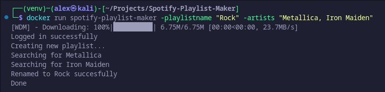

# Spotify Playlist Creator

### This is a Python script that automates the process of creating a Spotify playlist with the albums of the given artists.

#

## Prerequisites

To run this script, you need to have the following:

- Docker

## Installation

- Clone this repository.
- Build the Docker image.
- Enjoy!

## Results



## Usage

To use this script, follow these steps:
Create a .env file in the project directory with your login credentials as follows:

```
EMAIL=myemail@email.com
PASSWORD=mypassword
```

Build the Docker container:

```
docker build -t spotify-playlist-maker .
```

Run the container with the desired playlist name and artists:

```
docker run spotify-playlist-maker -playlistname <playlist_name> -artists "<artist_1>,<artist_2>,...,<artist_n>"
```

Replace <playlist_name> with the name you want to give to your playlist, and <artist_1>,<artist_2>,...,<artist_n> with the names of the artists whose albums you want to add to the playlist. Separate the artist names with commas.

For example:

```
docker run spotify-playlist-maker -playlistname "Rock" -artists "Metallica, Iron Maiden"
```

This script will run in windowed mode by default. You will not see the screen as it will run using a virtual display with Xvfb. It was inteded this was since bugs would appear using Selenium's headless option.

This will create a new playlist called "Rock" and add all the albums of Metallica and Iron Maiden to the playlist.

The script will open a Chrome window and navigate to the Spotify website. It will then log in to your Spotify account and create a new playlist with the given name.
For each artist in the list, the script will search for the artist's page on Spotify, select the "Albums" section, and add all the albums of the artist to the playlist.
After all the artists have been processed, the script will rename the playlist to the given name.

## Contributing

Pull requests are welcome. For major changes, please open an issue first to discuss what you would like to change.
